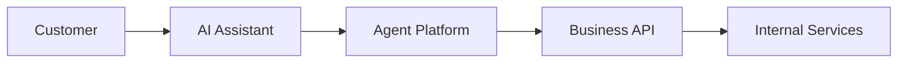
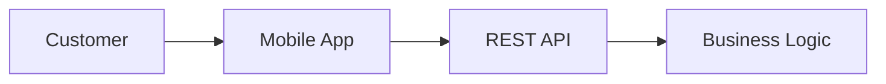

# Agent Platform

**The Open Standard for AI-Native Business Applications**

*Specification v0.1 — Draft, open for community feedback*

[](LICENSE)

[](#contributing)

---

For twenty years, software has been built around one assumption: a human is on the other end of the interface, clicking, tapping, scrolling. That assumption is breaking.

People already tell their assistant *"order my usual coffee"* instead of opening an app. A business that can only be understood by crawling its HTML effectively doesn't exist for that assistant — and, increasingly, doesn't exist for the customer standing behind it either.

**Agent Platform** is an open, vendor-neutral standard for exposing a business's products, policies, and workflows in a form AI agents can act on directly. It isn't another API to integrate. It's the AI-native front door of the business itself.

## Table of Contents

- [Why This Exists](#why-this-exists)
- [The Vision](#the-vision)
- [Quick Start](#quick-start)
- [How It Works](#how-it-works)
- [Core Principles](#core-principles)
- [The Agent Endpoint](#the-agent-endpoint)
- [Skills vs. Tools](#skills-vs-tools)
- [Example: A Coffee Shop, Agent-Native](#example-a-coffee-shop-agent-native)
- [Agent Platform vs. Everything Else](#agent-platform-vs-everything-else)
- [Why Not Just MCP?](#why-not-just-mcp)
- [FAQ](#faq)
- [Reference Implementation](#reference-implementation)
- [Roadmap](#roadmap)
- [Business Model and Strategy](#business-model-and-strategy)
- [Contributing](#contributing)
- [License](#license)

## Why This Exists

Every business today speaks a few dialects:

| Interface | Built for |
|---|---|
| Website | Humans with a mouse |
| Mobile app | Humans with a thumb |
| REST / GraphQL API | Developers writing integrations |

None of them were built for a fourth consumer that has shown up in the last two years: an autonomous AI agent, acting on a person's behalf.

Lacking a real interface, agents today fall back on:

- Crawling HTML that was never meant to be machine-read
- Driving a browser the way a human would
- Reverse-engineering undocumented endpoints
- Screenshotting the screen and guessing with vision models

All of this is slow, brittle, and breaks the moment a page is redesigned. It's also unfair to the business itself, which has no reliable way to guarantee the agent sees its pricing, promotions, and policies the way it actually intends them to be seen.

## The Vision

Every company should expose an **Agent Endpoint**, the same way it exposes a website today:

```
api.company.com   → for developers
agent.company.com → for AI agents
```

This single endpoint becomes the authoritative channel between a business and any AI system acting on its behalf — covering catalog, pricing, policy, checkout, and tracking, all in a form built to be *reasoned about*, not *rendered*.

This is deliberately not "another MCP." MCP standardizes how a model calls a tool. **Agent Platform standardizes how a business presents itself** — the knowledge, workflows, and commerce logic sitting behind those tools. Think of it less as an API spec and more as an **AI runtime for the business itself**.

## Quick Start

The reference implementation is designed to feel like scaffolding a modern web app, not integrating a spec by hand:

```bash
npx create-agent-platform
```

Out of the box, this is designed to:

- Scan your existing REST / OpenAPI endpoints and auto-generate agent-callable tools from them
- Stand up `agent.company.com` with documentation written for agents, not humans
- Expose the same capabilities over MCP, A2A (Agent2Agent), and other supported protocols at once
- Validate your deployment against the Agent Platform specification
- Simulate conversations against your endpoint, from the perspective of major assistants
- Report on how AI agents actually use your business — what they ask, what they buy, where they drop off
- Run regression tests so an agent-facing workflow that works today still works after your next deploy
- Handle conversation memory, response caching, and streaming for you
- Let you add custom **skills** as plugins, without touching the runtime itself

> 🚧 This is the target developer experience for the reference implementation, not a finished product yet — see [Roadmap](#roadmap).

## How It Works



Agent Platform sits as an intelligent adapter between the assistant a customer already uses and the systems a business already runs. It doesn't replace your backend — it gives it a voice AI agents can understand natively.

Compare that to the traditional path:



Same business logic underneath. A completely different front door.

## Core Principles

| Principle | What It Means |
|---|---|
| **Open** | Apache 2.0. No vendor lock-in, no proprietary extensions. |
| **AI-First** | Designed for autonomous reasoning, not screens. |
| **Human-Independent** | Fully functional with no UI in the loop. |
| **Discoverable** | An agent finds what it can do without a human reading docs first. |
| **Self-Describing** | Every deployment explains its own capabilities, live. |

## The Agent Endpoint

A conforming deployment exposes a predictable, agent-readable surface:

```
agent.company.com/
├── about              — who the business is
├── products           — catalog
├── pricing            — current prices & promotions
├── policies           — returns, shipping, terms
├── examples           — sample interactions
├── skills             — high-level actions the agent can take
├── tools              — the implementation behind each skill
├── promotions         — active offers
├── recommendations    — cross-sell / up-sell logic
├── orders             — order lifecycle
├── checkout           — commerce flow
├── tracking           — fulfillment status
├── authentication     — how an agent proves who it's acting for
├── events             — webhooks / subscriptions
├── mcp                — MCP server(s), if exposed
├── openapi            — OpenAPI spec, if exposed
└── docs               — human-readable fallback docs
```

An agent should never need to open a webpage to understand what a business can do for it.

## Skills vs. Tools

This distinction is the core of the spec:

| | Skills | Tools |
|---|---|---|
| Describe | **Intent** — what can be done | **Implementation** — how it's done |
| Audience | The agent's planning layer | The agent's execution layer |
| Examples | *Search Products, Place Order, Track Shipment, Request Refund, Book Appointment* | The function signatures, endpoints, or MCP calls behind each skill |
| Changes when | The business's offering changes | The backend implementation changes |

Separating the two means a business can rebuild its entire backend without breaking a single agent integration — as long as the skills stay the same.

## Example: A Coffee Shop, Agent-Native

**Agent asks:**

> Find premium espresso beans below €40.

**Agent Platform responds:**

```json
{
  "product_id": "123",
  "price": "€29",
  "promotion": "Buy two, get 5% off",
  "recommended_add_ons": ["Paper filters", "Coffee grinder", "Reusable container"],
  "estimated_delivery": "Tomorrow"
}
```

**Agent continues, in the same breath:**

> Create order.

No webpage opened. No form filled in. No screenshot taken.

## Agent Platform vs. Everything Else

| Capability | REST API | GraphQL | MCP alone | Agent Platform |
|---|:---:|:---:|:---:|:---:|
| Machine-callable | ✅ | ✅ | ✅ | ✅ |
| Self-describing to an agent | ⚠️ needs docs | ⚠️ schema only | ✅ tools only | ✅ business + tools |
| Encodes policy & promotions | ❌ | ❌ | ❌ | ✅ |
| Encodes commerce workflow | ❌ | ❌ | ❌ | ✅ |
| Standardized discovery | ❌ | ⚠️ | ✅ | ✅ |
| Protocol-agnostic (MCP, A2A, OpenAPI…) | — | — | ❌ | ✅ |

## Why Not Just MCP?

MCP standardizes **how a model calls a tool**.
Agent Platform standardizes **how a business presents itself**, to any agent, over any protocol.

They complement each other rather than compete: a single Agent Platform deployment can expose one or several MCP servers as part of its `tools` surface, alongside OpenAPI, A2A, or protocols that don't exist yet.

## FAQ

**Does this replace my existing API?**
No. Agent Platform sits in front of it. Skills map to the business logic you already have — you're not rewriting your backend.

**Is this affiliated with any AI company?**
No. Agent Platform is an independent, vendor-neutral specification, designed to work with any assistant the way HTML works with any browser.

**Do I have to support every protocol — MCP, A2A, OpenAPI — to conform?**
No. The spec is modular. Expose whichever protocols fit your stack; Agent Platform describes how they fit together, not which ones you're required to use.

**Is this production-ready?**
Not yet. This is a v0.1 draft specification. See [Roadmap](#roadmap).

## Reference Implementation

The project intends to ship, fully open source:

- Core Server
- SDKs — TypeScript, Go, Python, Rust
- Validation CLI
- Testing framework for agent-facing workflows
- Agent Simulator, for testing against multiple assistant personas
- Documentation Generator
- Capability Inspector

## Roadmap

- [x] **v0.1** — Publish the specification (this document) for community feedback
- [ ] **v0.2** — Core Server reference implementation + TypeScript SDK
- [ ] **v0.3** — `create-agent-platform` CLI: OpenAPI auto-discovery, MCP/A2A auto-exposure
- [ ] **v0.4** — Agent Simulator + conformance test suite
- [ ] **v1.0** — Stable spec, multi-language SDKs, certification program

## Business Model and Strategy

Kubernetes, Terraform, GraphQL, and MCP itself all followed the same arc: a manifesto and a specification came first, adoption followed, and a business grew out of support, hosting, and tooling only after that. Agent Platform is deliberately following that path rather than starting from a pitch deck.

The protocol itself stays free, forever — no feature sits behind a commercial license. If a business grows around it, it will come from optional services layered on top, not from the standard:

Managed cloud hosting · Enterprise support · Compliance & security audits · High availability · Monitoring & observability · Managed authentication · Developer training · Certification · Consulting

## Contributing

This is early-stage, and shaped by whoever shows up first. See [CONTRIBUTING.md](CONTRIBUTING.md) for how to propose spec changes, contribute code, and the PR process.

## License

Apache 2.0 — the specification and all reference implementations are, and will remain, fully open source.

---

*Agent Platform isn't a product of any single company. It's an attempt at a shared answer to one question: what does a business's front door look like when a growing share of its visitors are agents, not people?*
